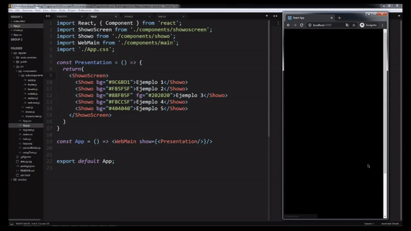

# ShowoScreen, a React component to start customizable 5-slide presentations with message, before loading a website

Based on my Showo component, I have created this new component "ShowoScreen". I must confess that I kept it for a while; Nowadays I see the code and I am aware that I can refactor it in a better way. However, he didn't want to stop uploading it for sentimental and creative reasons. Still, I will continue to load updated and improved components.

> Don't forget that It does not necesary write "px" to define the property font-size in Showo.

> You can find the full example at: 

